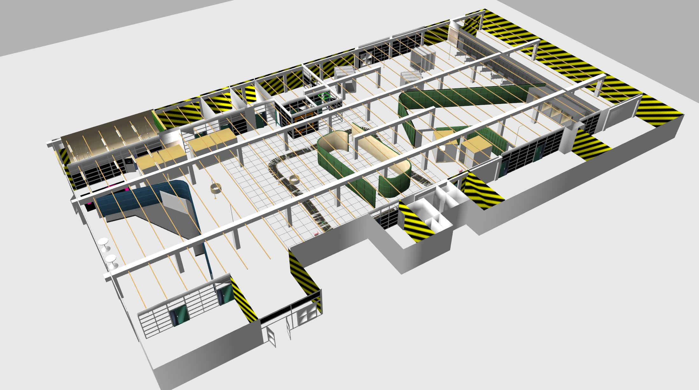
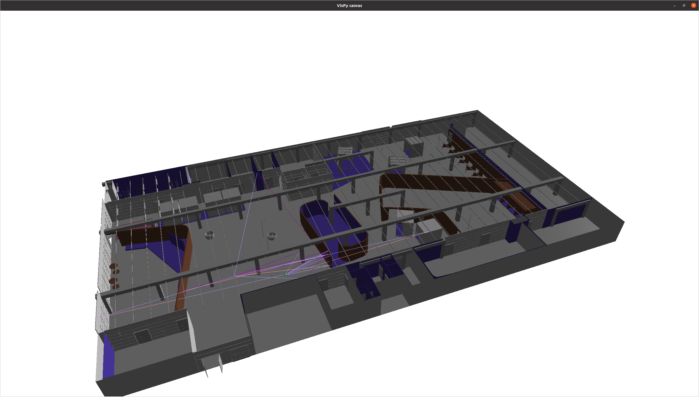

# DreamerV2 Meets Gazebo - C-JEPA & W-JEPA

This repository provides the implementation of **Coupled Control-JEPA (C-JEPA)** and **Wireless-JEPA (W-JEPA)** for communication-aware remote robotic control.

The framework combines robot observations and dynamics from **ROS/Gazebo** with wireless channel information generated using **Sionna RT**. C-JEPA is first pretrained in a Gym racing-car environment and then fine-tuned in Gazebo. W-JEPA is trained using CSI data collected from the synchronized Sionna RT environment.

## Requirements
The main dependencies are:

- Ubuntu 20.04
- ROS Noetic (ROS1)
- Gazebo Classic
- Python 3
- PyTorch
- OpenCV
- Gym / Gymnasium
- Sionna / Sionna RT

## Simulation Environments
The framework uses two synchronized simulation environments: **Gazebo** for robot simulation and **Sionna RT** for wireless channel simulation. Both simulators represent the **same physical environment with identical geometry and spatial configuration**, enabling consistent robot and wireless simulations.

### Gazebo - Robot Environment
The environment is first constructed in Gazebo, which provides robot dynamics, camera observations, robot states, and control interfaces through ROS.
<p align="center">
  
</p>

### Sionna RT – Wireless Environment
The same environment is reconstructed in Sionna RT while preserving the corresponding geometry and coordinate system. Sionna RT is then used for physics-based ray tracing, wireless channel modeling, and CSI generation.
<p align="center">
  
</p>
The robot position, orientation, and motion are synchronized between Gazebo and Sionna RT, allowing the wireless channel to be evaluated according to the robot's movement in the Gazebo environment.


## Training

The training procedure consists of three main stages.

### Control-JEPA Pre-training

C-JEPA is first trained using the Gym racing-car environment.

```bash
cd c_jepa/control_jepa/test/
python3 train.py
```
The trained model weights are saved and used to initialize the Gazebo training stage.

### Control-JEPA Fine-tuning in Gazebo

Load the pretrained C-JEPA weights and fine-tune the model using observations and robot dynamics from the Gazebo environment.

First, launch the Gazebo environment:

```bash
roslaunch gz_sionna jetbot_tellus.launch 
```
Then load the pretrained C-JEPA weights and fine-tune the model using observations and robot dynamics from Gazebo:

```bash
python3 c_jepa/control_jepa/test/train_gazebo.py
```

### Wireless-JEPA Training 

CSI data are generated from Sionna RT and synchronized with the corresponding robot pose, velocity, and latent control state from C-JEPA. The resulting dataset is then used to train W-JEPA.

```bash
python3 c_jepa/wireless_jepa/src/train.py
```
## Running the Coupled Framework

Launch the Gazebo environment:

```bash
roslaunch gz_sionna jetbot_tellus.launch 
```
Once the Gazebo environment is running, start the Control-JEPA (C-JEPA) module in a separate terminal:

```bash
python3 c_jepa/control_jepa/test/Gazebo_model_test.py
```
With Gazebo, C-JEPA, and W-JEPA running simultaneously, the coupled remote-control demo is ready to run.

```bash
python3 c_jepa/wireless_jepa/src/wireless_jepa.py
```

## Demo in action

[](https://www.youtube.com/watch?v=hw_bdS3P6Oc)

## Contributors
1. H.P. Madushanka ([madushanka.hewapathiranage@oulu.fi](madushanka.hewapathiranage@oulu.fi))
2. Sumudu Samarakoon ([sumudu.samarakoon@oulu.fi](sumudu.samarakoon@oulu.fi))
3. Mehdi Bennis ([mehdi.bennis@oulu.fi](mehdi.bennis@oulu.fi))
